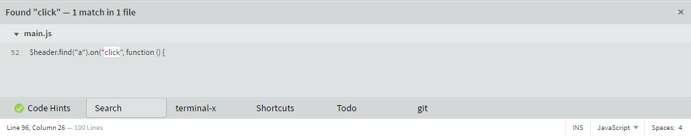

# Brackets Panels Hack

An hack to avoid to see stacked panels.

**NOTE:** this extension works by overwriting some Brackets functions.
There are good chances something will not work as you would expect.

## How to install

It is available in the Extension Manager.

## Usage by other extensions

Ideally both the panel and the toolbar icon, if available, should be added in the `AppInit.htmlReady` callback or before.

Make sure to add a title to your extension panel. 
If there isn't one, the string of the panel id it is retrieved and it is "cleaned up". 
Examples:
- `brackets-foo.panel --> Foo`
- `foo.bar.brackesfeature --> Feature`

This extension tryes also to move the icon from the main toolbar to the tabbar. 
It does that by looking for an icon with these id:
- the same id of the panel but followed with `-icon` 
`brackets-foo.panel --> brackets-foo.panel-icon`
- if the id terminates with `panel` replaces it with `icon` 
`brackets-foo.panel --> brackets-foo.icon`

## Screnshot

